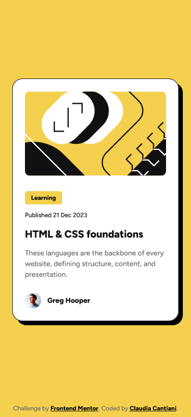

# Frontend Mentor - Blog preview card solution

This is a solution to the [Blog preview card challenge on Frontend Mentor](https://www.frontendmentor.io/challenges/blog-preview-card-ckPaj01IcS). Frontend Mentor challenges help you improve your coding skills by building realistic projects.

## Table of contents

- [Overview](#overview)
  - [The challenge](#the-challenge)
  - [Screenshot](#screenshot)
  - [Links](#links)
- [My process](#my-process)
  - [Built with](#built-with)
  - [What I learned](#what-i-learned)
  - [Continued development](#continued-development)
- [Author](#author)

## Overview

### The challenge

Users should be able to:

- See hover and focus states for all interactive elements on the page

### Screenshot

### Links

- Solution URL: [solution URL here](https://www.frontendmentor.io/solutions/blog-post-preview-with-semantic-html-P26ZErE-Bs)
- Live Site URL: [live site URL here](https://cla91.github.io/blog-preview-card-main/)

## My process

### Built with

- Semantic HTML5 markup
- CSS custom properties
- Flexbox
- CSS Grid
- Mobile-first workflow
- Relative units (rem)

### What I learned

I aimed for a clear and meaningful HTML structure using tags like article, header, section, footer, and time. I also ensured the h2 was semantically correct while also functioning as a clickable link.

### Continued development

I want to further explore CSS methodologies like BEM for larger projects to improve class naming consistency. I also plan to delve deeper into advanced responsive techniques or accessibility features beyond basic hover/focus states.

## Author

- Sito web - [Claudia Cantiani | Front End Developer](https://cla91.github.io/)
- Frontend Mentor - [@cla91](https://www.frontendmentor.io/profile/cla91)
- GitHub - [https://github.com/cla91](https://github.com/cla91)
